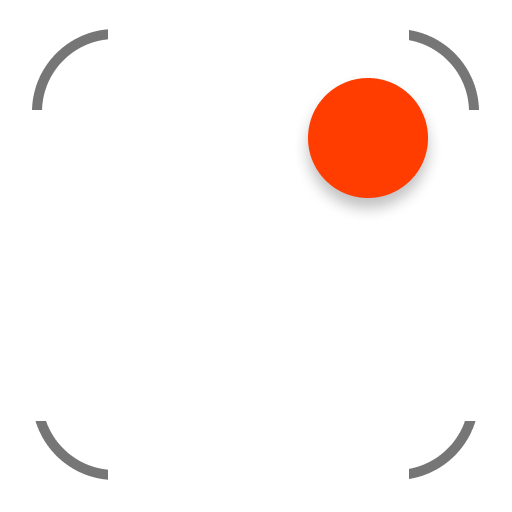

<p align="center">
	
	<h3 align="center">CaptureKit</h3>
	<p align="center">Record the screen on macOS with ScreenCaptureKit.</p>
</p>

## Requirements
- macOS 12.0 or later

## Install

```sh
npm install capturekit
```

*Requires macOS 12.0 or later.*

## Usage

```js
import {setTimeout} from 'node:timers/promises';
import { recorder } from 'capturekit';

const options = {
	fps: 30,
	cropArea: {
		x: 100,
		y: 100,
		width: 500,
		height: 500,
	},
};

await recorder.startRecording(options);

await setTimeout(3000);

console.log(await recorder.stopRecording());
//=> '/private/var/folders/3x/jf5977fn79jbglr7rk0tq4d00000gn/T/cdf4f7df426c97880f8c10a1600879f7.mov'
```

## API

#### screens() -> `Promise<Object[]>`

Get a list of screens. The first screen is the primary screen.

Example:

```js
[
	{
		id: 69732482,
		name: 'Color LCD',
	},
];
```

#### audioDevices() -> `Promise<Object[]>`

Get a list of audio devices.

Example:

```js
[
	{
		id: 'AppleHDAEngineInput:1B,0,1,0:1',
		name: 'Built-in Microphone',
	},
];
```

#### recorder

#### recorder.startRecording([options?](#options))

Returns a `Promise` that fullfills when the recording starts or rejects if the recording didn't start after 5 seconds.

#### recorder.stopRecording()

Returns a `Promise` for the path to the screen recording file.

## Options

Type: `object`

#### fps

Type: `number`\
Default: `30`

Number of frames per seconds.

#### cropArea

Type: `object`\
Default: `undefined`

Record only an area of the screen. Accepts an object with `x`, `y`, `width`, `height` properties.

#### showCursor

Type: `boolean`\
Default: `true`

Show the cursor in the screen recording.

#### screenId

Type: `number`\
Default: `aperture.screens()[0]` _(Primary screen)_

Screen to record.

## Why

providing a JavaScript interface to the **best** available method for recording the screen using ScreenCaptureKit.

